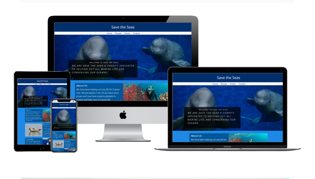
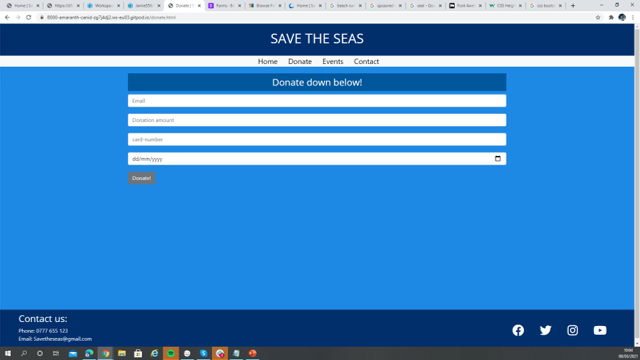
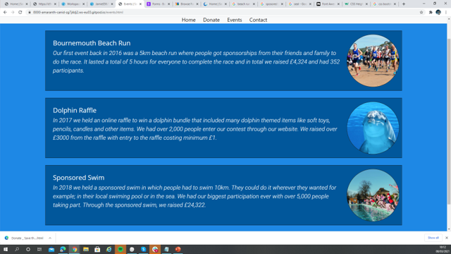
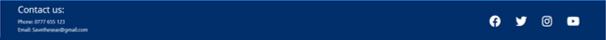
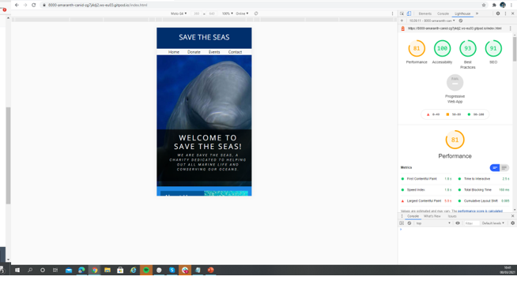

# Save-The-Seas

## What is Save The Seas?

Save the seas is a charity that is dedicated to the conservation of sea life and our oceans.
The Goals of the website in order of importance:

1. Promote awareness of the need to protect the oceans and educate people on sea life. This is the most important because the charity believe spreading awareness is most important as it will inspire more people to help in anyway they can, even if its not through donating. Also someone who is inspired is more likley to continue helping in the future rather than just a one off donation. 
2. Get people to donate to the charity. Getting donations is the next most important goal of the website as money helps. A donation is the easiest way for people to help the charity and what the majority of people are expected to do when they come onto the website.
3. Tell people about previouse fund raisers the charity has put on. This is not as important as the other two goals for the charity because it doesn't directly help the cause but it does showcase the charities previouse work which they are proud of and want to show off.

 This Website is the best way to do this as the internet is clearly the new way to advertise products, buisnesses, ideas and easily share them around via social media which is want Save the Seas want to spread awareness of Sea life. As this website will have a modile first aproach this will help with the shareability of the website.

---
## UX:

### Who is Save the Seas for?

Save The Seas is for people who are are intrested in learning more about sea life consevation and helping out. The target audience is 18 to 60 year olds as you will need to be over 18 to donate and this age range would be more likley to share the page than anyone who is older. Although under 18s won't be able to donate the website should be accessible to them as the main goal of Save the Seas is to inspire and you can still inspire young people to help via fundraisers or donate through an adult.

### User stories:

* "As a passionate dolphin lover I want to be able to donate easily and simply without having to fill out lots of forms to help out."
* "As someone who is studying Marine biology I want to learn ways in which I can help the oceans in an easy format."
* "As someone who is looking to set up a charity drive I want to be able to find the most effective ways to raise money."
* "As someone who isnt' good with the internet i would like to be able to easily find out how to contact Save the Seas and find out more via a newsletter or phone call."

## Wireframes:

### Home page Mobile

1. Button menu bar doesn't look as nice as a drop down menu but works more functionally on mobile and tablet because if you accidentally click on a drop down it will annoy the user as it covers up the content trying to be viewed by the user.
2. Big image to show user what the website is about and big text giving them a welcome.
3. Box layout with half text half picture looks repetitive, will try combining "Why help" and "How to help".
4. Icon works well, just another visual element that tells the user what this text is about.
5. Info looks a bit clustered, may work better on tablet/ bigger screen.
6. Although picture links to content in above box visually it looks seperate so i don't think this works.
7. Tried using circle images instead rectangular images and also alternating the side the image is on to try and make the page feel less repetitive. I prefer this over the previous two but not sure about the circles.
8. Changed pictures back to rectangles which fills the container better which I prefer.

### Home page Tablet

1. Just a straight copy of Mk. 4 from the mobile layout just everything scaled up to fit the tablet screen. looks good and clean still. Also text carries on below the screen making the user scroll revealing the rest of the page. 
2. Copy of Mk. 2 from mobile version where "Why help" and "How to help" were merged. definitely looks better on tablet than on mobile with the extra space between the text. and the picture below looks like it is linked too the info more. 
3. Tried putting text over image but it looks a bit squashed and makes the L shape of the text look awkward. and doesn't really work.

### Home page Desktop

1. Hidden Menu Button means menu takes up less space on the page making the whole page look cleaner but has an obvious icon that is intuitive to click.
2. Circles look cleaner on the bigger page and fit nicely on the page with the content clearly linked to the picture plus there's room to have all the info next to each other on the bigger screen.
3. Just checking what the menu bar looks like as a button bar rather than hidden, i prefer the hidden menu.

### Donation Page

1. Just a little bit of text to get people to donate.
2. Just a simple form to be able to donate.

### Events Page

1. Circle looks nice and clean.
2. I did think about putting the events horizontally but vertically works better for adding more events in the future.

### Contact Page

1. just a realy simple and intuitive form to fill out.

---
## Features:

### Existing Features

1. Home page that consits of info about the charity.
2. Events page with the history of fundraisers held by the charity.
3. Donation page for users to donate money.
4. Contact page for users to send in questions.
5. Social links that direct to our socials.

###Future Features

1. A sign up form to a news letter would be good to include and help the user out that wanted easier ways of contact.
2. An image carousel on the front page would make the page look better.
3. Another future idea is to add relevant images to each page.

---
## Technologies Used:

1. [Bootstrap](https://getbootstrap.com/)
    * Bootstrap was used to help create a layout using columns. 
    * I also attempted a bootstrap nav bar but ended up just using links.
    * Bootstrap was also used to create forms on the contact and donation page.

2. [Font Awesome](https://fontawesome.com/v4.7.0/)
    * Font Awesome was used to bring in custom icons on the website.

3. [Google Fonts](https://fonts.google.com/?preview.text_type=custom)
    * Google fonts was used to bring specific fonts to the website making it look better.

4. [tinypng.com](https://tinypng.com/)
    * I used tiny-png to reduce the size of all my images so the page can load faster making a better user experience.

5. [Color Tool](https://material.io/resources/color)
    * I used color tool to help get a complimentry color scheme across the websiteto make a good user experience.

6. [Web Formatter](https://webformatter.com/html)
    * I used web formatter to make my code look clean.

---
## Testing:

1. Nav bar:

    i. Clicking the button on the dropdown menu doesn't open the dropdown. As this is only a feature on destop size and is a non-crucial element of the page i am going to change it to the same menu as the mobile and tablet.
    
    ii. Nav bar is now just a clickable link menu. you can go to each page via any of the pages by using the nav bar.

2. Donation Page:

    i. One user wanted to be able to donate simply and easily.
   
    ii.  On the page it is very simple with everything on one page and only one button to submit once card details and name is inputted.
    
    iii. Although the form is very easy to fill out and understand, the data does not go anywhere or get processed once submit is pressed.

    

3. Events page

    i. One user wanted to learn about charity events and best ways to raise money.
    
    ii. the event age is clearly visible when you first load up the website. and if you click on that it will give you information about our previose charity events.

    

4. Contact Page:

    i.  Although the form is very easy to fill out and understand, the data does not go anywhere or get processed once submit is pressed.

5. Non internet Contact:

    i. One user wants to be able to contact us but not via our contact page.

    ii. in the footer of every page is our phone number and email but our contact form is also very intuitive and easy to use with just one button and a text box to put in there question.

    

6. Websites design on different sized devices:

    i. The website haas been designed with a mobile first view but has been tested on all screen sizes with the exact same funtionality and accesibility to all features of the website as you would get on both desktop and tablet.
    
    ii. The design of the website still looks good across all screen sizes aswell.

7. HTML Validation:

    i. I used the W3 validator to validate all my pages.

    * Home Page [index.html](https://validator.w3.org/nu/?doc=https%3A%2F%2Fjamies56.github.io%2FMilestone-Project-1%2Findex.html)
    * Donation Page [donate.html](https://validator.w3.org/nu/?doc=https%3A%2F%2Fjamies56.github.io%2FMilestone-Project-1%2Fdonate.html)
    * Events Page [events.html](https://validator.w3.org/nu/?doc=https%3A%2F%2Fjamies56.github.io%2FMilestone-Project-1%2Fevents.html)
    * Contact Page [contact.html](https://validator.w3.org/nu/?doc=https%3A%2F%2Fjamies56.github.io%2FMilestone-Project-1%2Fcontact.html)

    ii. There are no errors across any of the pages, only a warning about the document not being mapable to XML 1.0 due to having two consecutive hyphens. however it is required to have to consecutive hyphens to heve comments in the code.

8. CSS Validation:

    i. I used W3C CSS validator to validate my CSS.

    * [style.css](https://jigsaw.w3.org/css-validator/validator?uri=https%3A%2F%2Fjamies56.github.io%2FMilestone-Project-1%2Findex.html&profile=css3svg&usermedium=all&warning=1&vextwarning=&lang=en)

    ii. When put through the jigsaw css validator 17 errors came up, but they were all from bootstrap and warnings from bootstrap and font awwesome.

9. Websites on different browsers:

    i. throughout the website creation i have viewed the website on google chrome, microsoft edge, samsung mobile browser, apple safari. and they all run well and look good.

10. Lighthouse Test:

    i. Here is my results from running a Loghthouse test in the browser.

    
---
## Deployment:

To deploy the website I went onto github and clicked on my project, scrolled down to the bottom and switched the sauce from none to main. Then refreshed the page scroll back down and my link was there.

To run the code locally you will need to create a git hub acount, then go to my page [jamies56](https://github.com/JamieS56) and click on Milestone Project 1. there will be all the files and you can click on each one to view the code. you can then copy and paste the code into an editor for example git pod and run it yourself.

---
## Credits

* main-picture-dolphins.jpeg was taken from [visitsealife.com](https://www.visitsealife.com/loch-lomond/media/0j4pyn4m/little-grey-and-little-white.jpg)
* why-help.jpg was taken from [thoughtco.com](https://www.thoughtco.com/thmb/-fRDsfUZsSrInume9ADTIUczuwI=/1887x1415/smart/filters:no_upscale()/83398504-56a5f6d93df78cf7728abcf6.jpg)
* how-to-help.jpg was taken from [mission.cmaquarium.org](https://mission.cmaquarium.org/app/uploads/2020/07/CMA37410-1024x683.jpg)
* about-us.jpg was taken from [core-sites-cdn-adm.imgix.net](https://coresites-cdn-adm.imgix.net/mpora_new/wp-content/uploads/2015/12/Marine-Conservation-Scuba-Diving-Fish-Ocean-680x510.jpg)
* beach-run-bournemouth.jpg was taken from [visitilfracombe.co.uk](https://www.visitilfracombe.co.uk/item/beat-the-bach-woolacombe-10k-beach-run/)
* dolphin-raffle.jpg was taken from [thecarousel.com](https://thecarousel.com/wp-content/uploads/2016/03/the-carousel-dolphin.jpg)
* sponsored-swim.jpg was taken from [southwarknews.co.uk](https://www.southwarknews.co.uk/wp-content/uploads/2019/11/crisis_45857571438-e1572881003253.jpg)

* The forms used in this project were taken from [Bootstrap](https://getbootstrap.com/docs/5.0/forms/overview/).
* Icons in this website were taken from [Font Awesome](https://fontawesome.com/v4.7.0/).
---

## Acknowledgements 

I recieved inspiration for this project from [Save Our Seas](https://saveourseas.com/)