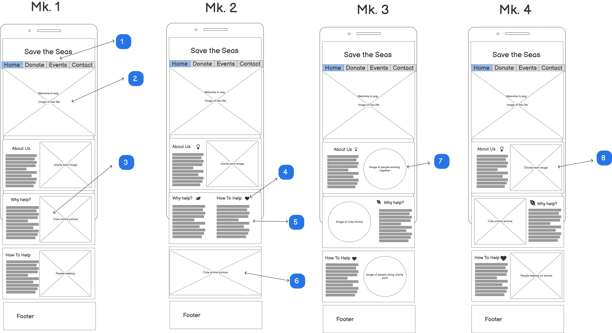
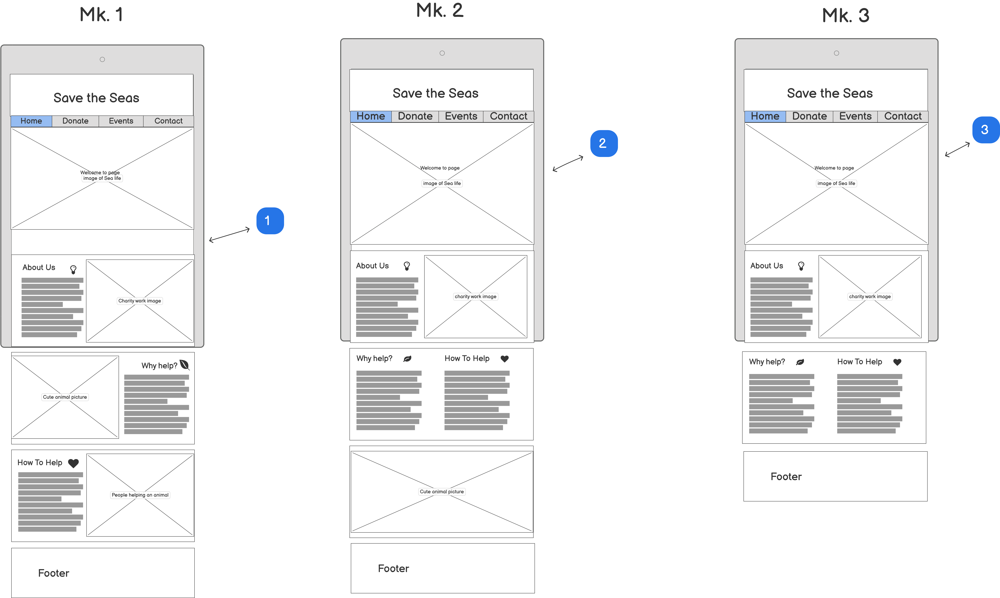
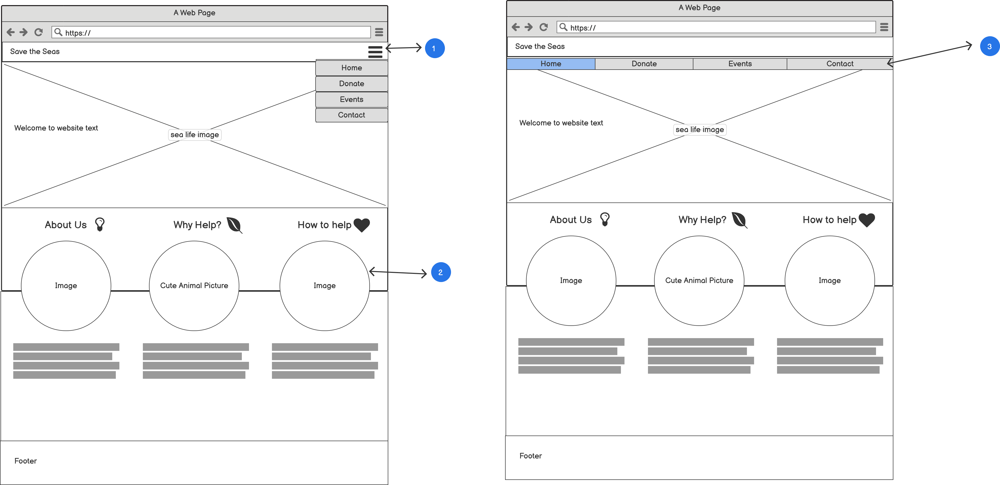
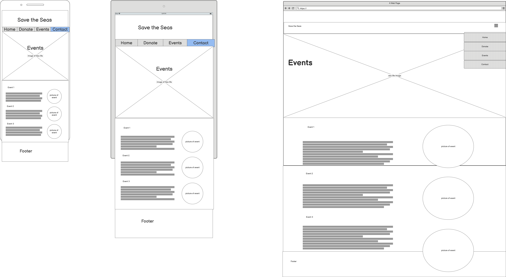
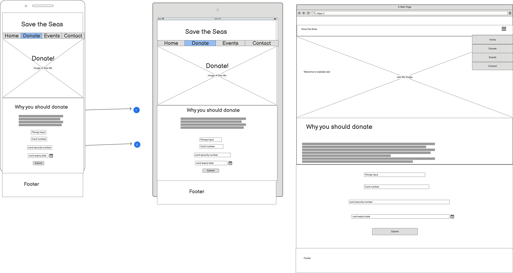
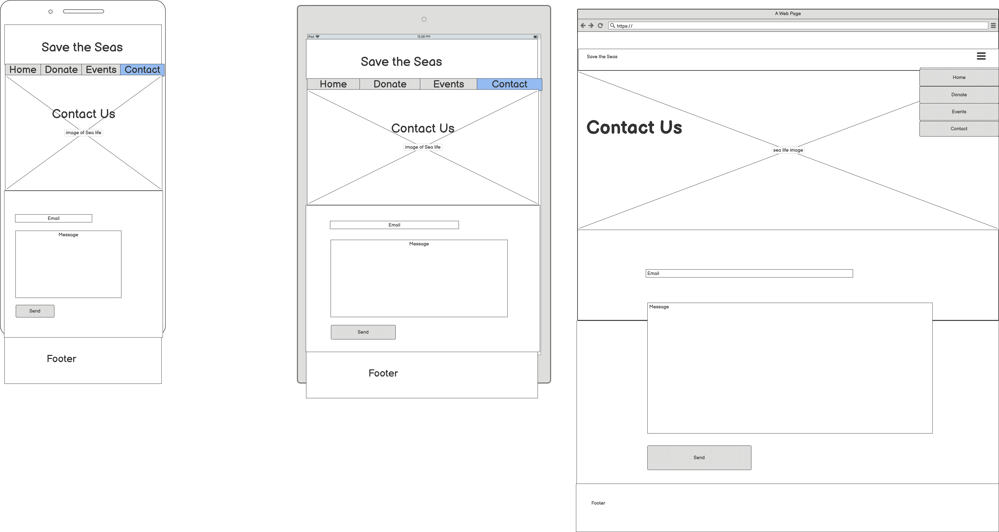

# Save-The-Seas

## What is Save The Seas?

Save the seas is a charity that is dedicated to the conservation of sea life and our oceans.
The Goals of the website in order of importance:

1. Promote awareness of the need to protect the oceans and educate people on sea life. This is the most important because the charity believe spreading awareness is most important as it will inspire more people to help in anyway they can, even if its not through donating. Also someone who is inspired is more likley to continue helping in the future rather than just a one off donation. 
2. Get people to donate to the charity. Getting donations is the next most important goal of the website as money helps. A donation is the easiest way for people to help the charity and what the majority of people are expected to do when they come onto the website.
3. Tell people about previouse fund raisers the charity has put on. This is not as important as the other two goals for the charity because it doesn't directly help the cause but it does showcase the charities previouse work which they are proud of and want to show off.

 This Website is the best way to do this as the internet is clearly the new way to advertise products, buisnesses, ideas and easily share them around via social media which is want Save the Seas want to spread awareness of Sea life. As this website will have a modile first aproach this will help with the shareability of the website.

---
## UX

### Who is Save the Seas for?

Save The Seas is for people who are are intrested in learning more about sea life consevation and helping out. The target audience is 18 to 60 year olds as you will need to be over 18 to donate and this age range would be more likley to share the oage than anyone wo is older. although under 18s wont be able to donate the website should be accessible to them as the main goal of Save the Seas is to inspire and you can still inspire young people to help via fundraisers or donate through an adult.

### User stories:

* "As a passionate dolphin lover I want to be able to donate easily and simply without having to fill out lots of forms to help out."
* "As someone who is studying Marine biology I want to learn ways in which I can help the oceans in an easy format."
* "As someone who is looking to set up a charity drive I want to be able to find the most effective ways to raise money."
* "As someone who lives near the sea I would like to know if any events are taking place near me and if I can attend."
* "As someone who isnt' good with the internet i would like to be able to easily find out how to contact Save the Seas and find out more via a newsletter or phone call."

## Wireframes:

### Home page Mobile

1. Button menu bar doesn't look as nice as a drop down menu but works more functionally on mobile and tablet because if you accidentally click on a drop down it will annoy the user as it covers up the content trying to be viewed by the user.
2. Big image to show user what the website is about and big text giving them a welcome.
3. Box layout with half text half picture looks repetitive, will try combining "Why help" and "How to help".
4. Icon works well, just another visual element that tells the user what this text is about.
5. Info looks a bit clustered, may work better on tablet/ bigger screen.
6. Although picture links to content in above box visually it looks seperate so i don't think this works.
7. Tried using circle images instead rectangular images and also alternating the side the image is on to try and make the page feel less repetitive. I prefer this over the previous two but not sure about the circles.
8. Changed pictures back to rectangles which fills the container better which I prefer.

### Home page Tablet

1. Just a straight copy of Mk. 4 from the mobile layout just everything scaled up to fit the tablet screen. looks good and clean still. Also text carries on below the screen making the user scroll revealing the rest of the page. 
2. Copy of Mk. 2 from mobile version where "Why help" and "How to help" were merged. definitely looks better on tablet than on mobile with the extra space between the text. and the picture below looks like it is linked too the info more. 
3. Tried putting text over image but it looks a bit squashed and makes the L shape of the text look awkward. and doesn't really work.

### Home page Desktop

1. Hidden Menu Button means menu takes up less space on the page making the whole page look cleaner but has an obvious icon that is intuitive to click.
2. Circles look cleaner on the bigger page and fit nicely on the page with the content clearly linked to the picture plus there's room to have all the info next to each other on the bigger screen.
3. Just checking what the menu bar looks like as a button bar rather than hidden, i prefer the hidden menu.

---
## Features
---
## Technologies Used
---
## Testing

nav bar:
1. I have 

---
## Deployment
---
## Credits
main-picture-dolphins.jpeg was taken from "https://www.visitsealife.com/loch-lomond/media/0j4pyn4m/little-grey-and-little-white.jpg"
seal.jpg was taken from "https://theconversation.com/how-diving-seals-plan-ahead-to-save-oxygen-new-research-121909"

---
## Acknowledgements 
i recieved inspiration for this project from save our seas "https://saveourseas.com/"